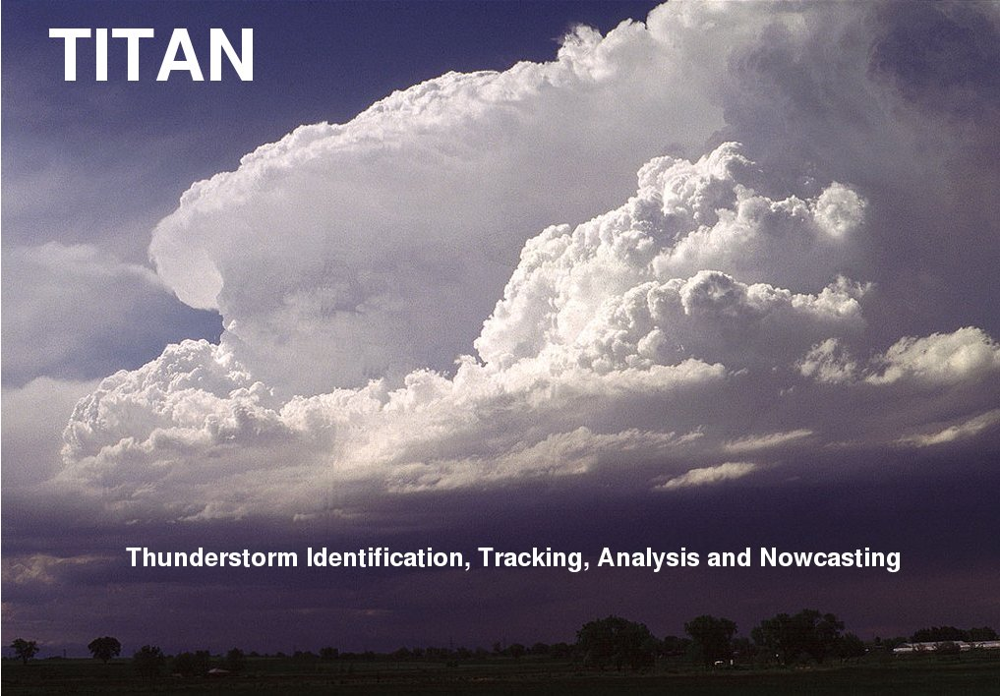

## TITAN - Thunderstorm Identification Tracking Analysis & Nowcasting

<a name="overview"/>

## Overview

1. [Introduction](./docs/topics/introduction.md)
2. [Storm Indentification](./docs/topics/storm_identification.md)
3. [Storm Tracking](./docs/topics/storm_tracking.md)
4. [Forecasting](./docs/topics/forecasting.md)
5. [Storm Analysis](./docs/topics/storm_analysis.md)
6. [Storm Climatology](./docs/topics/storm_climatology.md)
7. [History](./docs/topics/history.md)
8. [Acknowledgements](./docs/topics/acknowledgements.md)

## TITAN on GitHub

The TITAN project is now hosted on [GitHub](https://github.com).

The TITAN applications are part of the LROSE - the Lidar Radar Open Software Environment. The LROSE core can be found at [lrose-core](https://github.com/NCAR/lrose-core).

The templates for the scripts and parameter files reside in the lrose-titan respository - [lrose-titan](./templates).

###### Photos courtesy of Greg Thompson, NCAR/RAL, Boulder, CO, USA.

