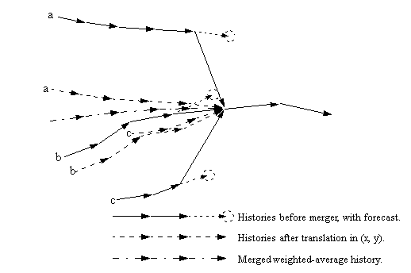
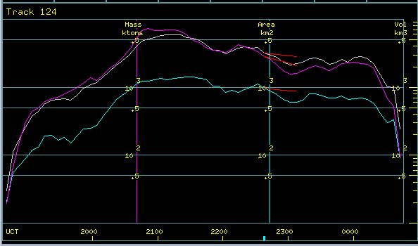

[Top](../../README.md)
[Back](./storm_tracking.md)
[Fwd](./storm_analysis.md)

# Short-term forecasting

## Extrapolation forecasts

In formulating the storm forecast algorithm, we make the following simplifying assumptions based on observations of typical storm behavior:

 - A storm tends to move along a straight line;
 - Storm growth or decay tends to follow a linear trend;
 - Random departures from the above behavior occur.

As as result, TITAN relies purely on extrapolation for forecasting. A weighted linear fit is performed to the time-history of the storm property for which a forecast is required. The following figure shows a typical linear fit for forecast parameter p.

#### Weighted linear fit to storm time history

Linear trend forecasts are made for the following storm properties:

 - Projected area centroid (X,Y)
 - Volumetric centroid Z
 - Reflectivity-weighted centroid Z
 - Top
 - Max dBZ
 - Volume
 - Precipitation flux
 - Mass
 - Projected area
 - Speed
 - Direction

## Handling mergers and splits

The forecast depends on the recent storm history. Therefore, when a merger or split occurs, the history must be combined or split accordingly.

### Forecasts for X,Y - location, speed and direction

Consider the merger depicted in the following figure. The positional history of the merged track is a combination of the histories of the three parent tracks. First, the parent track histories are translated in (x, y) so that their forecast positions coincide with the centroid after the merger. These translated histories are then combined as a weighted average, where the weights are the ratio of the storm volume for each parent to the sum of the volumes of all parents. The weights change at each time in the history, depending on the size history of each of the parents.

#### Handling (x,y) time history in a merger

In the case of a split, the history of each child is a copy of the history of the parent, translated to coincide with the centroid of that child - see the figure below. The translated histories are only used for forecasts; they do not affect the statistical analysis of storm properties.

#### Handling (x,y) time history in a split

### Forecasts for storm size - area, volume, mass etc.

In the merger case, the history of a parameter is computed as the sum of the histories of the parents. In the split case, the history for a child is computed as the history for the parent scaled by the ratio of the volume of that child storm to the sum of the volumes of all of the children.

## Forecast examples

The following figure shows a 30-minute forecast of storm location, presented as a series of forecasts at 6 minute intervals. The storm speed is also shown in km/hr. Growing storms have increasing forecast areas while decaying storms have decreasing forecast areas.

#### Storm speed/direction/location forecast

The following figure shows a time-series plot of storm mass (magenta), area (cyan) and and volume (gray) for a particular storm track. The red lines are the 30-minute forecast for each property. Since this is an analysis example, the remaining history of the storm track is also shown, although that would not be the case in a real-time situation.

#### Storm mass/area/volume forecast

[Top](../../README.md)
[Back](./storm_tracking.md)
[Fwd](./storm_analysis.md)

