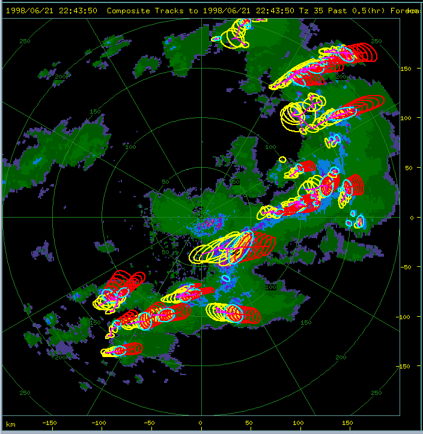

[Top](../../README.md)
[Back](./forecasting.md)
[Fwd](./storm_climatology.md)

# Storm analysis

## Spatial storm properties

Storm tracks may be presented in geographical view in a number of ways, depending upon the need. The following plots were produced using the Rview display application.

#### Current storm polygons

A simple plot showing the current location of the storms represented as polygons.

#### Recent past and near forecast as polygons

This shows the current storm location in cyan, the recent (30-min) past in yellow and the 30-min forecast in red. This can get a little cluttered, so the figure below this one uses ellipses instead of polygons.

#### Recent past and near forecast as ellipses

This shows the current storm location in cyan, the recent (30-min) past in yellow and the 30-min forecast in red. This is less cluttered than the previous figure because of the use of ellipses instead of polygons.

#### Full track as ellipses

This shows an entire track for analysis, using ellipses to represent storm location. The current location is in cyan, the past in yellow and the future in green. The 'future' locations would not be there in real-time of course, but for analysis purposes it is useful to show an entire track.

#### Full track as filled ellipses

Similar to the previous figure, except using filled ellipses of alternating brightness. The current location is in cyan, the past in yellow and the future in green. Filling the ellipses provides a result which is easier on the eye while revealing the complexity of the track.

#### All tracks in a day, as vectors

All of the tracks for a single day, represented as vectors. This is useful for categorizing days, based on aggregate storm movement, for climatological purposes.

#### All tracks in a day, as filled ellipses

All of the tracks for a single day, represented as filled ellipses. This is useful for categorizing days, based on aggregate storm movement, for climatological purposes.

## Storm time histories

#### Time history of volume, area, mass, precip flux and vil

Time history of storm properties. Volume (gray), area (cyan), mass (magenta),  precipitation flux (green) and VIL (yellow).

#### Time-height profile of max dBZ

Top and base are in yellow, the Z-weighted centroid is in cyan and the height of max echo is in blue, along with the maximum value.

#### Time-height profile of mean dBZ

Top and base are in yellow, the Z-weighted centroid is in cyan and the height of max echo is in blue, along with the maximum value.

#### Time-height profile of vertical distribution of mass

This colors show the percentage of mass at each height in the storm, with time.

#### Time-height profile of storm rotation

The is dependent on the availability of Doppler velocity. It shows the estimated rotation of the storm about its centroid, at each height and time. Contiguous regions of red or blue indicate significant rotation, as in a supercell. A meso-cyclone will only be shown if it is colocated with  the storm centroid.

#### Time history of hail metrics

Shown are the FOKR (gray), WaldVogel probability (cyan), hail mass (green) and vertically integrated hail mass (magenta).

#### Time history of reflectivity distribution

This shows the distribution of reflectivity in the storm volume, with time. The height of each color shows the percentage of the storm volume which contains reflectivity in that color interval.

[Top](../../README.md)
[Back](./forecasting.md)
[Fwd](./storm_climatology.md)

