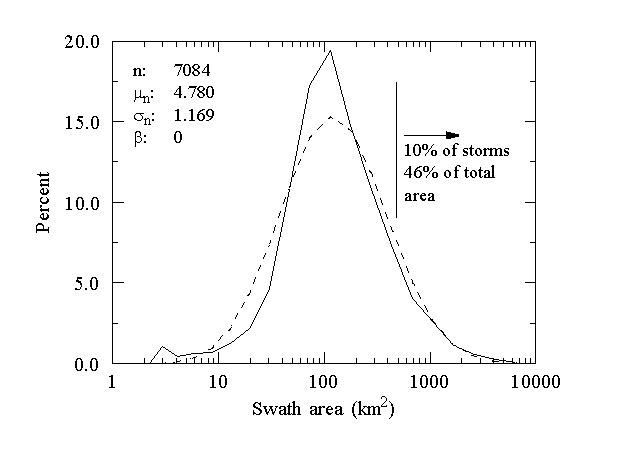

[Top](../../README.md)
[Back](./storm_analysis.md)
[Fwd](./cloud_seending_analysis.md)

# Storm climatology

## Spatial climatology

The TrackGridStats application produces analyses of storm tracks over extended periods of time, such as complete seasons or multiple seasons. The output is in the form of 2-D grids which contain information on the spatial variability of various storm properties. 

The following figures show some of the properties which may be computed in this way. The properties are  for the month of August 1995 using data from the Front Range NEXRAD near Denver.

#### Spatial climatology of storm volume

This is overlain with the climatology of storm motion.

#### Spatial climatology of storm area

#### Spatial climatology of storm precipitation

#### Spatial climatology of storm duration

#### Spatial climatology of storm tops

#### Spatial climatology of maximum storm refectivity

## Aggregate climatology

The TracksAscii application produces ASCII tables of storm and track properties, which can then be analyzed by a suitable statistics package. Two categories of property are produced:

 - Instantaneous storm properties, such as tops
 - Aggregate track properties, such as duration.

### Instantaneous storm properties

 - Remaining duration (hrs)
 - Volumetric centroid lat (deg)
 - Volumetric centroid lon (deg)
 - Volumetric centroid x (km)
 - Volumetric centroid y (km)
 - Volumetric centroid z (km)
 - Reflectivity-weighted centroid lat (deg)
 - Reflectivity-weighted centroid lon (deg)
 - Reflectivity-weighted centroid x (km)
 - Reflectivity-weighted centroid y (km)
 - Reflectivity-weighted centroid z (km)
 - Precipitation centroid lat (deg)
 - Precipitation centroid lon (deg)
 - Precipitation centroid x (km)
 - Precipitation centroid y (km)
 - Precip area (km2)
 - Precip orientation (deg T)
 - Precip major radius (km)
 - Precip minor radius (km)
 - Precip flux (m3/s)
 - Precip rate (mm/hr)
 - Envelope centroid lat (deg)
 - Envelope centroid lon (deg)
 - Envelope centroid x (km)
 - Envelope centroid y (km)
 - Envelope area (km2)
 - Envelope orientation (deg T)
 - Envelope major radius (km)
 - Envelope minor radius (km)
 - Top (km)
 - Base(km)
 - Volume (km3)
 - Mean area (km2)
 - Mass (ktons)
 - Tilt angle (deg)
 - Tilt orientation (deg T)
 - Max dBZ (dBZ)
 - Mean dbz (dBZ)
 - Max dBZ gradient (dBZ/km)
 - Mean dbz gradient (dBZ/km)
 - Ht of max dBZ (km)
 - Vorticity (/s)
 - Vil from maxZ (kg/m2)
 - U (km/hr)
 - V (km/hr)
 - Dtop/Dt (km/hr)
 - Dvolume/Dt (km3/hr)
 - Dprecip_flux/Dt (m3/s2)
 - Dmass/Dt (ktons/hr)
 - DdBz_max/Dt (dBZ/hr)
 - Speed (km/hr)
 - Dirn (Deg T)
 - % vol > 40 dBZ
 - % area > 40 dBZ
 - % vol > 50 dBZ
 - % area > 50 dBZ
 - % vol > 60 dBZ
 - % area > 60 dBZ
 - % vol > 70 dBZ
 - % area > 70 dBZ
 - Hail-FOKR Cat 0-4
 - Hail-Waldvogel Prob
 - Hail-mass aloft ktons
 - Hail-Vihm kg/m2"

### Aggregate track properties

 - Duration (hr)
 - Remaining diration at maximum volume (hr)
 - Mean volume (km3)
 - Maximum volume (km3)
 - Mean mass (ktons)
 - Maximum mass (ktons)
 - Maximum precip depth, computed using ellipse (mm)
 - Mean precip depth, computed using ellipse (mm)
 - Mean precip depth, computed using storm grid points (mm)
 - Mean precip flux (m3/s)
 - Maximum precip flux (m3/s)
 - Mean envelope area (km2)
 - Maximum envelope area (km2)
 - Mean precip area (km2)
 - Maximum precip area (km2)
 - Mean top (km msl)
 - Maximum top (km msl)
 - Mean base (km msl)
 - Maximum base( km msl)
 - Mean dBZ
 - Maximum dBZ
 - Radar estimated rain volume (m3)
 - Area time integral (km2.hr)
 - Swath area computed using ellipse (km2)
 - Swath area computed using storm grid points (km2)
 - Mean speed (km/hr)
 - Mean direction (deg T)

### Example analyses

The following figures demonstrate some of the ways in which this data may be analyzed. The data for this analysis was obtained from the Mile High radar, near Denver, for the summer seasons 1991 through 1993.

#### Lognormal fit to precipitation area

#### Lognormal fit to precipitation flux

#### Lognormal fit to swath area

#### Lognormal fit to storm tops

#### Lognormal fit to maximum speed

#### Lognormal fit to maximum reflectivity

#### Lognormal fit to area time integral (ATI)

#### Exponential fit to duration > 15 min

#### Radar estimated rain volume (RERV) vs. Area time integral (ATI)

#### Volume vs. mean reflectivity

#### Precipitaiton area vs. volume

[Top](../../README.md)
[Back](./storm_analysis.md)
[Fwd](./cloud_seending_analysis.md)

