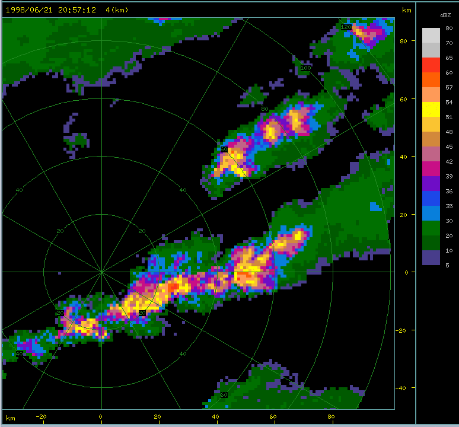
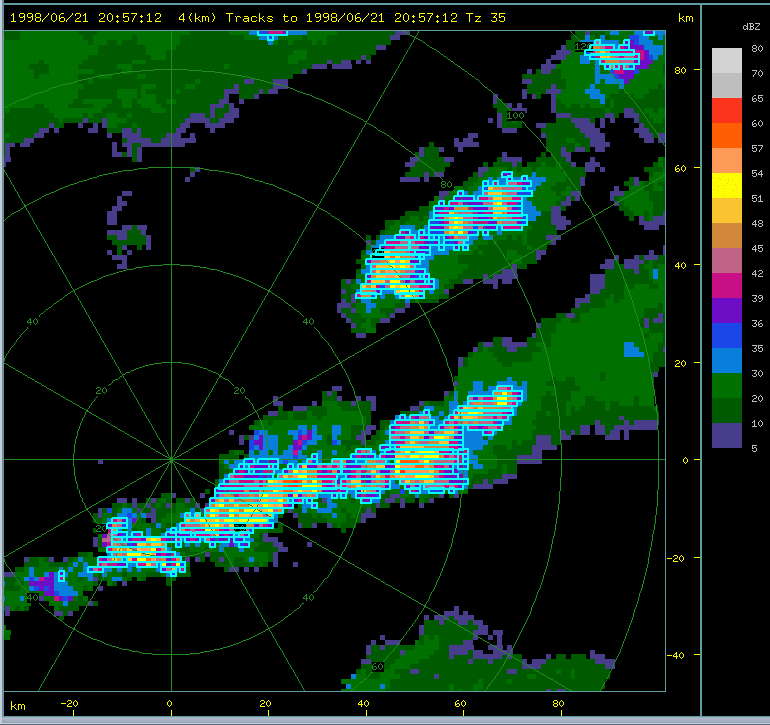
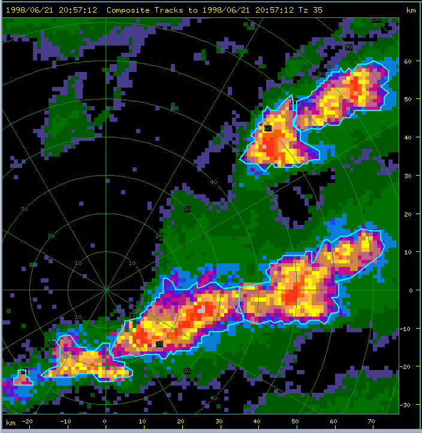
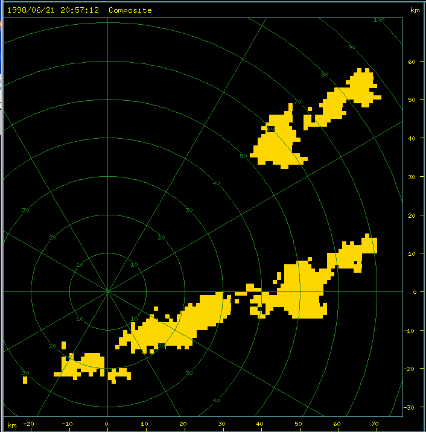
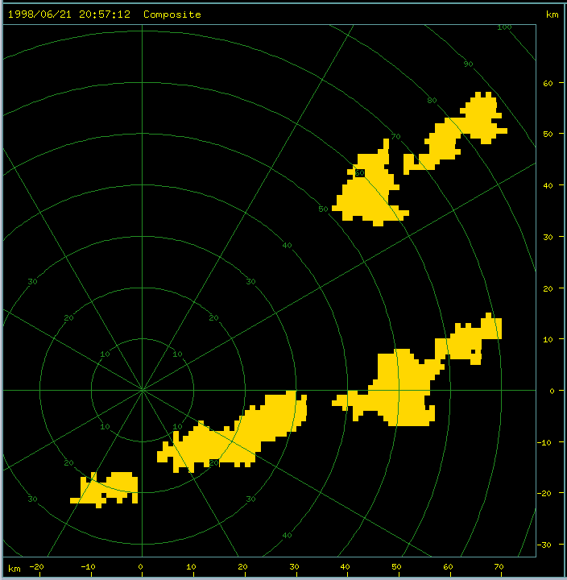
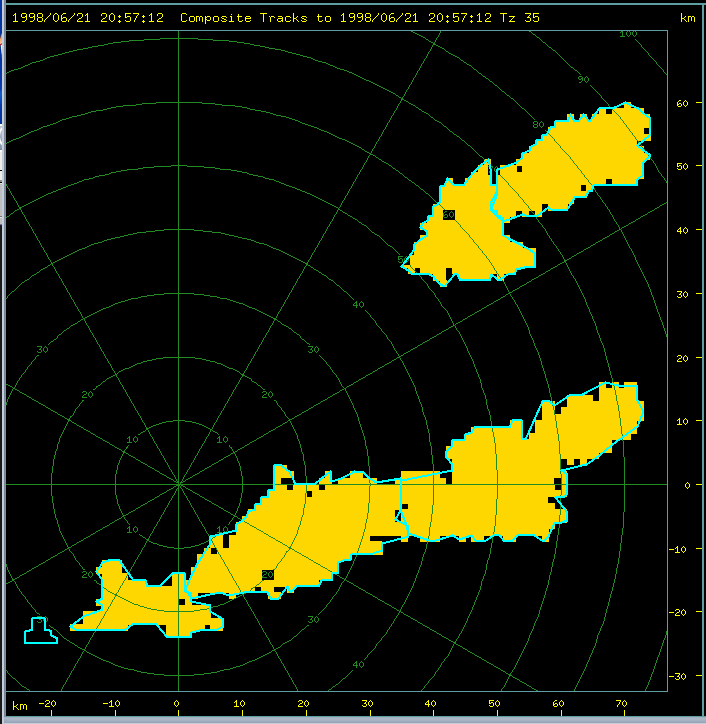
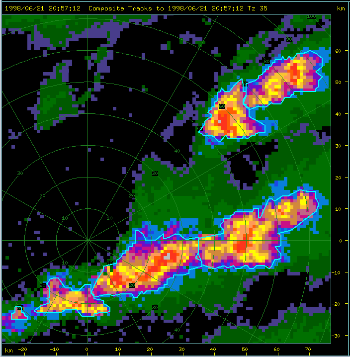

# Storm Identification

## Overview

TITAN identifies storms in 3-D (or 2-D) Cartesian radar data. The data is stored in radar 'volumes', where a volume refers to one 3-Dimensional scan of the sky surrounding the radar. Radars scan in modified polar-coordinates, which complicates the geometry. Therefore the data is converted into Cartesian coordinates before the storm identification step is performed. These Cartesian volumes can be thought of as a series of horizontal slices through the storms, or CAPPI (Constant Altitude Plan Position Indicator) planes, stacked one above the other with equal vertical spacing.  

## Single threshold identification

The following figure shows an example of slice at an altitude of 4km MSL from the FTG radar near Denver. The radar is located at the origin of the plot. The image shows radar reflectivity, in units of dBZ, which is a measure of power reflected back to the radar by the water drops in a cloud. The higher the reflectivity the more severe the weather phenomenon. A dBZ value of 30 indicates light rain or drizzle, 40 dBZ indicates moderate rain and 50 dBZ heavy rain. At values above 50 dBZ hail is likely.

#### CAPPI at 4 km

In this image, a line of strong storms lies just to the south of the radar stretching in a line towards the ENE. A second smaller line is seen to the NE of the radar.

TITAN identifies a 'storm' as a contiguous region in the atmoshpere with a reflectivity in excess of a set threshold. First, horizontal (E-W) segments in the data grid above the threshold are found. Then, overlaps between a segment and adjacent segments are identified. Searching for overlaps occurs in both the N-S and up-down directions since we are performing a 3-D analysis of the storms. Although configurable, the overlap is generally set to '1' - i.e., two regions of reflectivity only need to overlap by a single grid cell in order for both to be considered part of the same storm.

The following figure shows the same storms as in the previous figure, but with the first stage of storm identification shown. The cyan rectangles show which regions were identified as exceeding the reflectivity threshold. In this case we are using a threshold of 35 dBZ.

#### CAPPI with storm runs shown

As mentioned above, a storm is identified as a region of reflectivity in excess of the specified threshold. The search is constrained between a minimum and maximum height. Furthermore, a 'storm' is only considered valid if its volume exceeds a specified minimum volume.

Optionally a storm may be disregarded if its volume exeeds a specified maximum, or it contains reflectivity in excess of a specified maximum. This is useful for certain types of study, for example when only small or weak storms are of interest.

## Dual threshold identification

The problem with the single threshold method shown above is that two distinct storms sometimes appear  to 'touch' each other, in that briefly an overlap in their reflectivity regions occurs. However, the storms do not physically merge.

In order to deal with this problem, a second threshold is introduced. In the previous example, we used 35 dBZ as the primary threshold. The second threshold is typically set to 45 dBZ.

In the figure below, we show the same situation depicted above, but you can see that the storms, which would have been identified as single entities, have been divided up into a number of parts. So how do we achieve that?

#### Storms split up using the dual threshold

The following figure shows the 'composite' reflectivity for grid points with reflectivity which exceeds the lower threshold of 35 dBZ. In this context 'composite' means the maximum value at any height. In the dual threshold phase of the identification, we work in 2-D instead of 3-D.

#### Composite reflectivity showing overlaps

Next, we find the grid points which exceed the upper threshold, in this case 45 dBZ.

#### Points with DBZ > 45

We then discard some small areas to tidy things up and just leave what we consider to be significant regions with reflectivity in excess of the upper threshold.

#### Significant regions with DBZ > 45

And then finally we 'grow' the significant regions back out to the original 35 dBZ boundary. Where two growth boundaries meet, we stop growing, so that the significant regions are preserved as separate entities, but once again include the reflectivity down to the lower threshold. All of this is performed in 2-D. However, once the final storm boundaries are established, TITAN retrieves the original 3-D storm points and allocates them to the relevant storm.

#### Significant regions grown out to 35 DBZ boundary

## Spatial representation of storms

TITAN stores, optionally, the location of all of the grid points which make up the identified storm. That is how we are able to show the details of the storm runs in the figure <a href="#cappi_with_storm_runs">CAPPI with storm runs</a>.

There are 2 other storms representations which are useful: the ellipse and the polygon.

The ellipse is a simplified representation of the storm shape which is useful for some applications. It works well for distinct storms but not well for lines.

#### Ellipse representation of storms

The polygon is a 'complex hull' representation of the storm boundary. It is computed by projecting radials out from the storm centroid and finding the intersection point with the storm boundary. This works well for some complex storm shapes, but fails with shapes such as bow echoes. We are considering a more flexible shape format which would describe any storm shape adequately.

#### Polygon representation of storms

## Storm properties

An extensive list of properties are computed for each identified storm.

### Global properties: computed over the entire storm volume

 - Volumetric centroid in (x,y,z) (in km or deg depending on the projection)
 - Reflectivity-weighted centroid in (x,y,z) (in km or deg depending on the projection)
 - Top (km MSL)
 - Base (km MSL)
 - Volume (km3)
 - Mean area (km2)
 - Precipitation flux (m3/s)
 - Mass (ktons)
 - Angle of tilt (deg)
 - Direction of tilt (degT)
 - Max dBZ
 - Mean dBZ
 - Max vertical gradient of dBZ (dbz/km)
 - Mean vertical gradient of dBZ (dbz/km)
 - Height ot max DBZ (km MSL)
 - Mean radial velocity (if Doppler vel is available) (m/s)
 - Standard devation of radial velocity (if Doppler vel is available) (m/s)
 - Rotation rate about centroid (if Doppler vel is available) (/s)
 - Precipitation area (km2) - precip area is computed at lowest CAPPI in storm
 - Precipitation area centroid x (in km or deg depending on the projection)
 - Precipitation area centroid y (in km or deg depending on the projection)
 - Precipitation area ellipse orientation (degT)
 - Precipitation area ellipse minor radius (in km or deg depending on the projection)
 - Precipitation area ellipse major radius (in km or deg depending on the projection)
 - Projected area (km2) - projected area is envelope of storm when viewed from above
 - Projected area centroid x (in km or deg depending on the projection)
 - Projected area centroid y (in km or deg depending on the projection)
 - Projected area ellipse orientation (degT)
 - Projected area ellipse minor radius (in km or deg depending on the projection)
 - Projected area ellipse major radius (in km or deg depending on the projection)
 - Flag to indicate whether storm top is missing because it was too close to the radar
 - Flag to indicate that the storm was probably partially beyond maximum radar range
 - Flag to indicate that the storm is probably second trip echo - determined from the shape and orientation of the storm.
 - Flag to indicate that hail is probably present, base on reflectivity
 - VIL computed from max Z at each height in the storm

Optionally the following hail metrics are also computed:

 - FOKR category: 0 - 4
 - Waldvogel probability: 0 - 1
 - Hail mass aloft: ktons
 - Vertically integrated hail mass, from max Z: kg/m2

### Layer properties: computed for each CAPPI in the storm

 - Volumetric centroid in (x,y,z) (in km or deg depending on the projection)
 - Reflectivity-weighted centroid in (x,y,z) (in km or deg depending on the projection)
 - Area (km2)
 - Max dBZ
 - Mean dBZ
 - Mass (ktons)
 - Mean radial velocity (if Doppler vel is available) (m/s)
 - Standard devation of radial velocity (if Doppler vel is available) (m/s)
 - Rotation rate about centroid (if Doppler vel is available) (/s)

### Reflectivity distribution

A reflectivity distribution is computed both in 3-D (the distribution over the volume) and 2-D (the distribution over the projected area).

[ Top ](../../README.md)
[ Fwd ](./storm_tracking.md)
[ Back ](./introduction.md)

