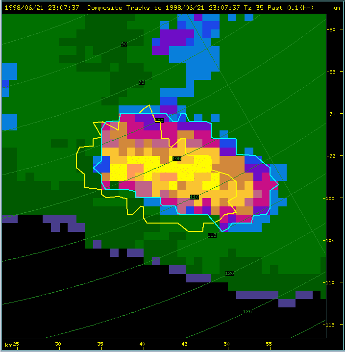
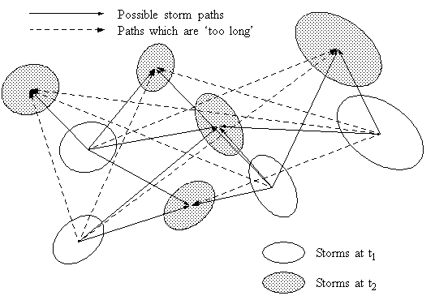
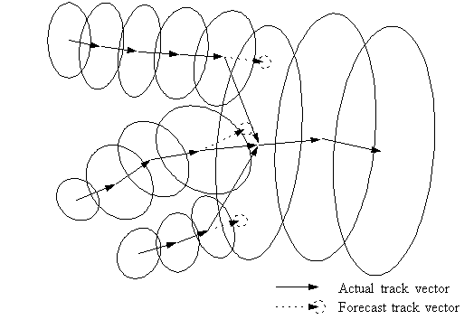
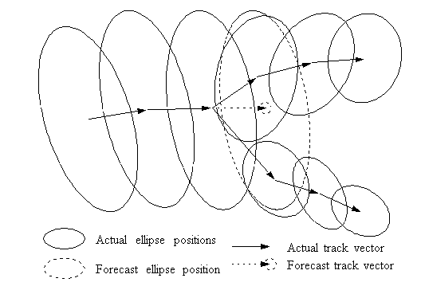
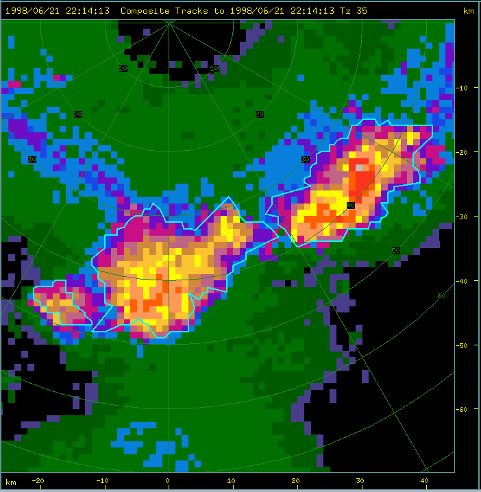
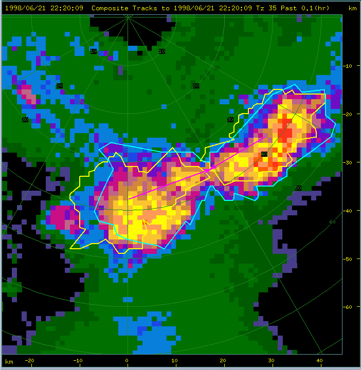
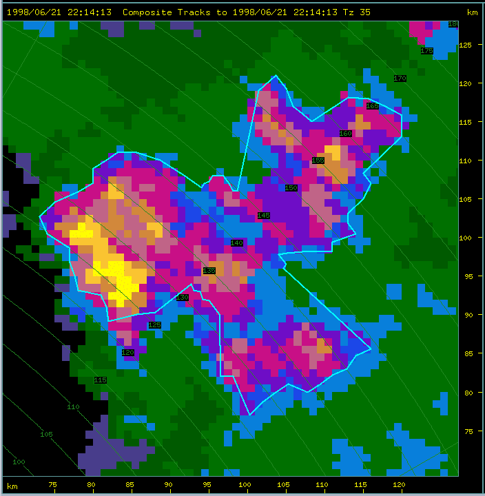
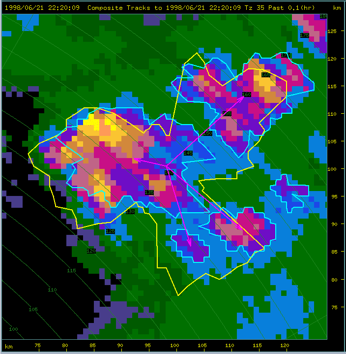

[Top](../../README.md)
[Back](./storm_identification.md)
[Fwd](./forecasting.md)

# Storm tracking

TITAN tracks storms by matching storms identified at one scan time with storms identified at the following scan time. Two methods are applied in order.

 - First we try to match storms using areal overlap. If storm shapes at two successive times overlap significantly, these shapes are likely to be from the same storm.</li>
 - Then, we use optimal centroid matching. An optimization scheme determines the most likely match between storms identifed at successive scans.</li>

## Matching using overlaps

The following figure shows an example of a storm shape at two successive scans. The cyan outline represents the storm for the current scan, and the yellow outline shows the storm shape for the previous scan. 

#### Storms overlapped at successive scans

Two overlap fractions are computed: (1) the overlap area divided by the area at time 1 (the yellow shape), and (2) the overlap area divided by the area at time 2 (the cyan shape). These 2 fractions are summed. A perfect overlap will result in a sum of 2.0, and no overlap at all will result in a sum of 0.0. If the sum exceeds a given value (normally 0.6) the storms are considered to be part of the same track.

## Matching using optimization

The following figure depicts the centroids and projected areas of two sets of storms, one set at time t1 and the other at time t2, the difference Dt being the time taken to collect a single volume scan (~ 5 to 10 min). There are not necessarily the same number of storms present at each time - in this example there are 4 storms at t1 and 5 storms at t2. The figure also shows the possible paths the storms may have taken during the period between t1 and t2. The problem is to match the t1 storms with their t2 counterparts, or equivalently to decide which set of logically possible paths most likely is the true one.

#### Storms locations for two successive scans

In order to track thunderstorms perfectly in all situations, the sampling system (e.g., radar in volume-scan mode) would determine the storm locations frequently enough to avoid any ambiguity in the matching. This is not the case in reality, and one has to adopt the approach of finding the most likely match. The difficulty in obtaining the correct match is affected by the temporal sampling rate, the spatial separation of the storms, their speed of movement and the predictability of their direction of movement.

Thunderstorms typically move at speeds of between 5 and 100 km h-1. Modern radars take from 3 to 6 min to scan a volume. A fast storm travelling at 100 km h-1 will move between 5 km and 10 km during that time. Storms typically have diameters of between 2 and 20 km. For storms which are separate and distinct, the lateral spacing between an adjacent pair will be at least as great as the mean diameter for the pair. So the spatial separation between an adjacent storm pair is somewhat greater than their mean diameter and may be as low as 2 km, though this is rare and usually the separation exceeds 5 km. There is clearly the chance of ambiguity in the match from one scan to the next because the storm separation is sometimes less than the distance moved between scans.

Storms generally do not follow each other very closely. If one storm has passed over an area it is likely to be some time before another will occur over the same area. This is because the first storm will have ingested some of the warm moist air from the boundary layer and replaced it with cold outflow from the downdraft, leading to conditions which are less favorable for convection than they were before the storm occurred. It takes some time for heating and moist air advection to re-establish favorable conditions.

The direction of movement may vary dramatically depending upon the relative strengths of lateral development (growth of new cells on the storm flanks) and advection (movement caused by the wind). The motion of most storms is affected to some extent by the ambient winds. However, lateral growth and other factors usually cause some deviation from the ambient wind speed and direction. Storms may change direction quite quickly and may even reverse direction, the latter case occurring when the growth on the upwind side causes an apparent movement upwind which is faster than the ambient wind. Erratic tracks often occur on calm days with strong storm growth.

For the purposes of setting up the matching problem as one of optimization we make the following assumptions about the correct set of matching storms:

 - The correct set will include paths which are shorter rather than longer. This is true for thunderstorms which are observed frequently (Dt ~ 5 min), because the ratio of the size of the storm (~ 2 - 20 km diameter) to the distance moved in Dt (~ 1 - 10 km) is such that it is unlikely that a storm will move well away, to have its former position (or one close to it) occupied by a different storm. Therefore, given a set of possible alternatives as shown in the figure above, the shorter the path the more likely it is to be a true one.
 - The correct set will join storms of similar characteristics (size, shape, etc.). For example, a 2000 km3 storm at t1 is more likely to match a 1500 km3 storm than a 100 km3 storm at t2.
 - There is an upper bound to the distance a storm will move in Dt, governed by the maximum expected speed of storm movement (advection plus lateral development). In the figure, the paths which exceed this upper bound are drawn as faint lines.

The problem of determining the true set of storm paths may be posed and solved as one of optimization. We search for the optimal set of paths, where this set minimizes the objective function defined below. If the assumptions are valid then the optimal set and the true set will be the same. In TITAN, the Hungarian algorithm is used to solve the optimization problem.

## Handling mergers and splits

Quite frequently two or more convective storms will merge to form a single storm, and somewhat less frequently a single storm will split into two or more storms.

The result of applying the matching scheme described above to mergers and splits is as follows:

 - Merger - a maximum of one track will be extended, and the remainder will be terminated
 - Split - a maximum of one track will be extended, and new tracks will be created for the unmatched storms.

The tracking scheme must handle these situations correctly. For example, consider the following figure, showing the merger of three storms.

#### Merging storms

The first step is to apply the matching algorithm as detailed above. Then, we search through the storms at t1 for those storms which were terminated at t2 by the matching algorithm. For each of these tracks we are able to make a forecast of the centroid position at t2. If this forecast position falls within the projected area of a storm at t2, we conclude that the t1 storm did not terminate but rather merged to form the t2 storm.

The splitting situation is treated similarly - see the following figure.

#### A splitting storm

In this case, for all the storms at t1, we forecast the position, shape and size of the storm at t2. Then we consider all those storms at t2 which are apparently new tracks, i.e., have no history. If such a storm has a centroid located within the forecast area of a storm, we conclude that a split has taken place.

## Merging example

The following two figures show an example of a two storms merging into one, at the same time that a third dies altogether.

#### Merging storms - scan before the merger

#### Merging storms - scan after the merger

## Splitting example

The following two figures show an example of a storm splitting into 4 parts. A new storm starts at the same time as the split occurs.

#### Splitting storm - scan before the split

#### Splitting storm - scan after the split

[Top](../../README.md)
[Back](./storm_identification.md)
[Fwd](./forecasting.md)
