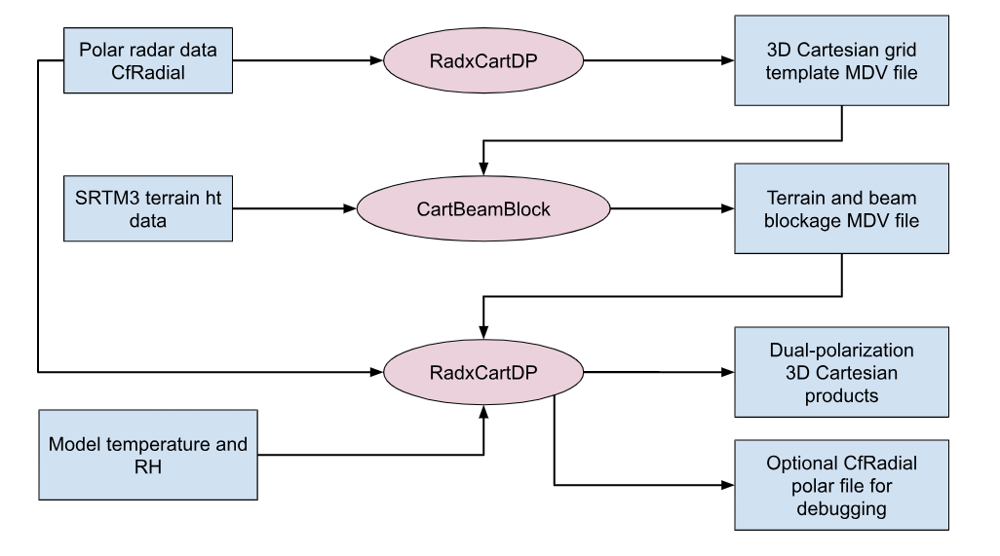

# TITAN Dual-Polarization tutorial

## Input data

The input data for this tutorial is from the PECAN field campaign. PECAN was run in Kansas from June to July 2015.

For this initial testing we are using data for the KFTG NEXRAD radar, located at the Front Range airport near Denver, Colorado.

* This is a convective storm case, with a squall line moving west to east.

The data (as a .tgz file) can be downloaded from Mike's Google drive:

* [TitanDP tutorial data](https://drive.google.com/drive/folders/1Hd3B5GvT4iaY7h_Gi4uR7RJYdorsXxC3)

To be consistent, you should create a ```$HOME/data``` directory and untar the file there.

```
  cd $HOME
  mkdir -p data
  cd data
  tar xvfz ~/Downloads/TitanDP_example_data.tgz
```

That will create the following data tree:

```
  ~/data/TitanDP/Terrain/DEM/SRTM3/N*.hgt
  ~/data/TitanDP/cfradial/kftg/moments/20150626/cfrad*nc
  ~/data/TitanDP/mdv/ruc/20150626/*.mdv.nc
```

These are, respectively:

* SRTM 3 arc second (90m) resolution Terrain Height Data from the shuttle mission.
* CfRadial data from KFTG radar.
* MDV model files from the RUC.

## Output data

After the full analysis has been run, the following derived data directories should exist:

```
  ~/data/TitanDP/ERA5/spdb/Strathmore/20240806* (soundings from ERA5)
  ~/data/TitanDP/ERA5/spdb/KingCity/20220521* (soundings from ERA5)
  ~/data/TitanDP/radar/cfradial/no_qc/Strathmore/20240806/cfrad.20240806*nc (cfradial before QC)
  ~/data/TitanDP/radar/cfradial/no_qc/KingCity/20220521/cfrad.20220521*nc (cfradial before QC)
  ~/data/TitanDP/radar/cfradial/qc/Strathmore/20240806/cfrad.20240806*nc (cfradial after QC)
  ~/data/TitanDP/radar/cfradial/qc/KingCity/20220521/cfrad.20220521*nc (cfradial after QC)
  ~/data/TitanDP/radar/cfradial/pid/Strathmore/20240806/cfrad.20240806*nc (cfradial PID)
  ~/data/TitanDP/radar/cfradial/pid/Strathmore/20240806/cfrad.20240806*nc (cfradial PID)
  ~/data/TitanDP/radar/cart/qc/Strathmore/20240806/ncf_20240806*nc (Cartesian MDC CF-compliant netcdf)
  ~/data/TitanDP/radar/cart/qc/KingCity/20220521/ncf_202205216*nc (Cartesian MDC CF-compliant netcdf)
  ~/data/TitanDP/titan/storms/Strathmore/20240806* (Titan binary files)
  ~/data/TitanDP/titan/storms/KingCity/20220521* (Titan binary files)
  ~/data/TitanDP/titan/ascii/Tracks2Ascii.hail.txt (Titan output converted by Tracks2Ascii)
  ~/data/TitanDP/titan/ascii/Tracks2Ascii.derecho.txt (Titan output converted by Tracks2Ascii)
  ~/data/TitanDP/titan/netcdf/Strathmore/titan_20240806.nc (Titan output converted by Tstorms2NetCDF)
  ~/data/TitanDP/titan/netcdf/KingCity/titan_20220521.nc (Titan output converted by Tstorms2NetCDF)
```

## Checking out the project

The Titan dual-polarization project is stored in the GitHub repo NCAR/lrose-titan.
This is also the location of this README file.

To check it out run:

```
  mkdir -p ~/git
  cd ~/git
  git clone https://github.com/ncar/lrose-titan
```

The structure of the TitanDP part of this repo is as follows:

```
  ~/git/lrose-titan/color_scales
  ~/git/lrose-titan/mape
  ~/git/lrose-titan/projects/TitanDP/params
  ~/git/lrose-titan/projects/TitanDP/scripts
  ~/git/lrose-titan/projects/TitanDP/data
```

## Overview

In this tutorial we process 2 data sets:

* hail
* derecho

For each case the logic and data flow is as follows:



## Setting up the environment

In the scripts directory you will find the file:

```
  ~/git/lrose-titan/projects/TitanDP/scripts/set_env_vars
```

This file setup up the environment, and is sourced by all of the scripts that we run for this project.

The defaults are as follows:

```
  setenv DATA_DIR $HOME/data/TitanDP
  setenv PROJ_DIR $HOME/git/lrose-titan/projects/TitanDP
```

The default settings work as is, if you have followed these instructions.

If you have a different layout, edit ```set_env_vars``` appropriately.

## Processing steps, running the scripts

You should run the scripts from the script directory:

```
  cd ~/git/lrose-titan/projects/TitanDP/scripts
```

### Create a template file for the Cartesian grid

```
  ./run_RadxCartDP.create_grid_template.kftg
```

This creates an MDV file with 1 field named ```template3D```.

This file has the specificed grid geometry for the Cartesian volume, for the specific radar - in this case KFTG. We read in one CfRadial file to get the radar metadata.

```
  $HOME/data/TitanDP/mdv/radarCart/kftg/template/20150626/20150626_005802.mdv.cf.nc
```

The template file will be used by ```CartBeamBlock``` to create a beam blockage file for the specified radar (KFTG) and Cartesian grid.

### Create the beam blockage file

```
  ./run_CartBeamBlock.kftg 
```

CartBeamBlock reads in:

* the template file to get the grid geometry.
* the SRTM3 digital terrain height data.

CartBeamBlock calculates the extinction fraction, at each Cartesian grid point, due to beam blockage caused by terrain.

CartBeamBlock is quite CPU-intensive, and will probably take at least 30 minutes to complete. It is only run once per radar and Cartesian grid.

While it is running, feedback on progress is provided to your terminal window. For example:

```
INFO - CartBeamBlock::_computeBlockage()
  nx, ny, nz: 800, 800, 34
  nThreads: 24
  maxRangeKm: 293.683
  nPoints2D: 640000
INFO - blockage computation, % complete, nPointsDone: 17, 108800
```

At this stage the computations are 17% complete.


You can view the results using HawkEye:

```
  ./run_HawkEye.no_qc.hail
  ./run_HawkEye.no_qc.derecho
```

You will notice that in the derecho case there is considerable interference, leading to radial spikes.

Hail case - no significant interference:


Derecho case - considerable interference:


### Convert raw HDF5 files with QC

Inspection of the spikes reveals that the sources of the interference are not coherent with the radars:

* SQI (NCP) is low
* SNR is reasonably low

In ```RadxConvert``` we have the option to censor the data fields using threshold applied to the input fields. Specifically we use RadxConvert to remove data at gates for which BOTH:

* SQI (NCP) < 0.2, AND
* SNR < 25 dB


The following runs that step:

```
  ./run_RadxConvert.qc.hail
  ./run_RadxConvert.qc.derecho
```

You can view the results in HawkEye, and compare to the non-QC step above.

```
  ./run_HawkEye.qc.hail
  ./run_HawkEye.qc.derecho
```

Hail case - clean:


Derecho case - interference largely mitigated:


Although not perfect, for the purposes of this project, this censoring QC step is sufficent to ensure that Titan does not produce artifacts.

## Computing PID as an alternative method of censoring

An alternative method for cleaning up interference is to run RadxPid, and censor non-meteorological echoes.

We downloaded the ERA5 reanalysis for these cases, and we can use that to save the model-based soundings:

```
  ./run_Mdv2SoundingSpdb.ERA5.hail
  ./run_Mdv2SoundingSpdb.ERA5.derecho
```

And we can then run RadxPid:

```
  ./run_RadxPid.hail
  ./run_RadxPid.derecho
```

The following shows the PID field for the derecho case:


The interference is identifed as clutter in this case.

And the following shows the result of using PID to clean up the reflectivity field:


For this tutorial we will use the QC data created by RadxConvert.

## Transform the polar data to Cartesian, using Radx2Grid.

Titan requires input data in Cartesian coordinates, rather than polar.

To perform this transformation, we run the following:


```
  ./run_Radx2Grid.hail
  ./run_Radx2Grid.derecho
```

On a Linux host, we can run CIDD to view the Cartesian fields, in addition to the polar fields:


```
  ./run_CIDD.hail
  ./run_CIDD.derecho
```

Cartesian DBZ data in CIDD, hail case:


Cartesian DBZ data in CIDD, derecho case:


On a Mac or Linux we can run Lucid, the replacement for CIDD that is under development:

```
  ./run_Lucid.hail
  ./run_Lucid.derecho
```

Cartesian DBZ data in Lucid, hail case:


Cartesian DBZ data in Lucid, derecho case:


As mentioned, Lucid is still under development and only some of the functionality is available. You can select fields, zooms and maps. The height selector is functional. The movie control slider works, for selecting different times. However, much of the time controller is not yet working.

## Running Titan

Titan runs on the Cartesian gridded data, using the DBZ field and optionally the VEL field to compute storm rotation.

```
  ./run_Titan.hail
  ./run_Titan.derecho
```

You can view the Titan tracks using Rview, which has a partner application TimeHist:

```
  ./run_Rview.hail
  ./run_Rview.derecho
```

Rview is a display application specifically designed to display Titan. We will need to demonstrate the interactive functionality. Rview on the mac seems to be crashing, so that will need to be debugged.

Rview and TimeHist, hail case:


Rview and TimeHist, derecho case:


## Exporting the Titan tracks using Tracks2Ascii

Tracks2Ascii exports the Titan track data in space-delimited ascii format:

```
  ./run_Tracks2Ascii.hail
  ./run_Tracks2Ascii.derecho
```

## Exporting the Titan tracks using Tstorms2NetCDF

Tstorms2NetCDF exports the Titan track data in NetCDF-4, using groups:

```
  ./run_Tstorms2NetCDF.hail
  ./run_Tstorms2NetCDF.derecho
```

For documentation on the NetCDF data model, see:

* [Titan Data in NetCDF](../../docs/pdf/TitanDataNetCDF.pdf)

## Running HailKE and HailKEswath

HailKE estimates Hail Kinetic Energy, using the Cartesian reflectivity field.

HailKEswath accumulates the results from HailKE into a swath over time.

To run HailKE for each case:

```
  ./run_HailKE.hail
  ./run_HailKE.derecho
```

To run HailKEswath for each case:

```
  ./run_HailKEswath.hail
  ./run_HailKEswath.derecho
```

You can view the swath using CIDD:

```
  ./run_CIDD.hail
  ./run_CIDD.derecho
```

and select the HailKE or HailKEswath fields:


