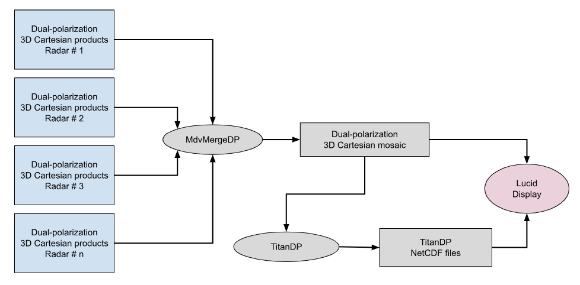
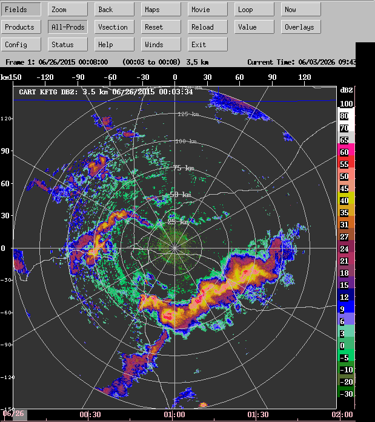
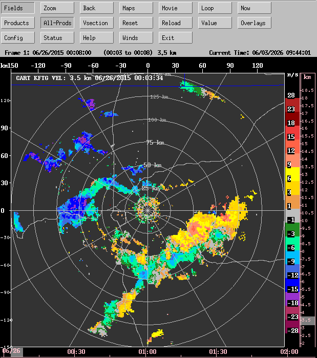
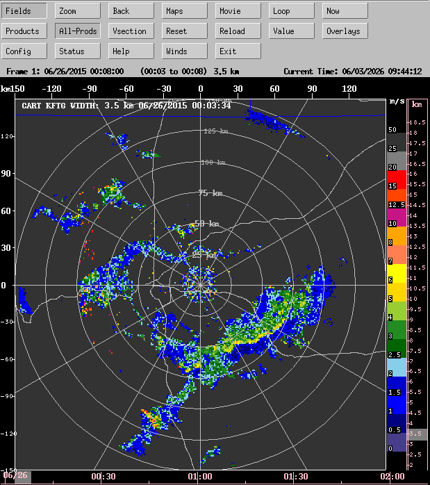
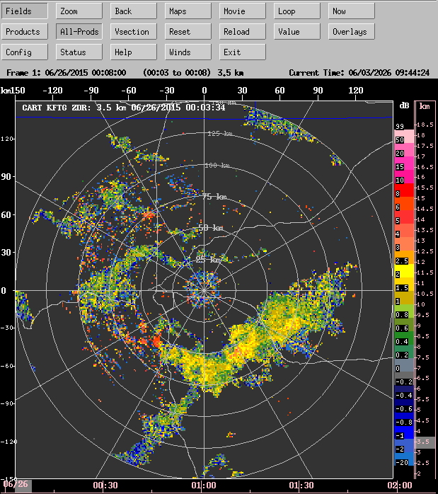
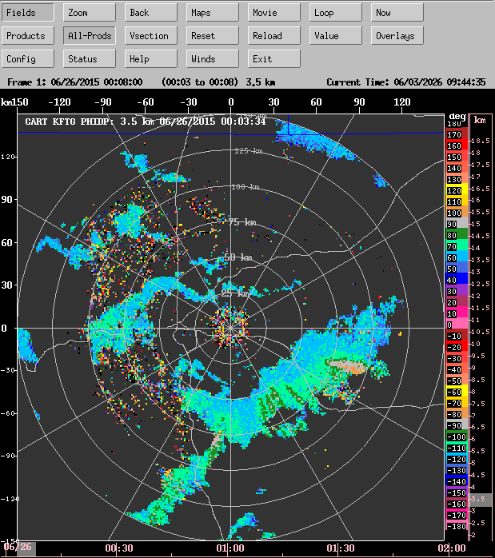
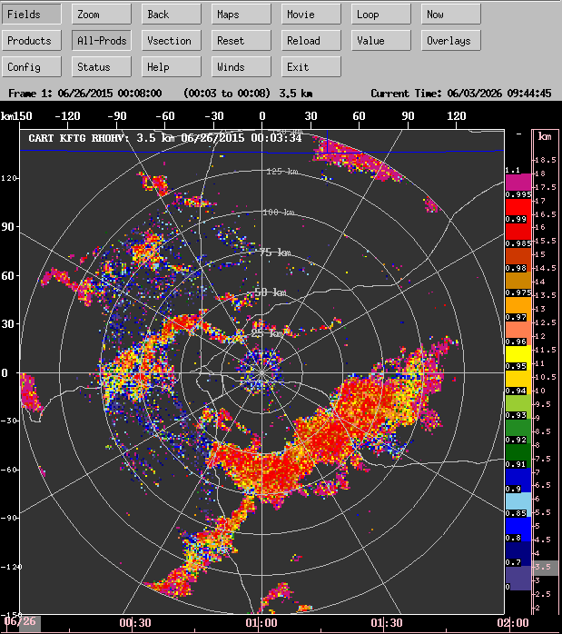
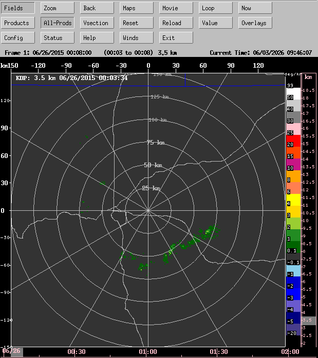

# TITAN Dual-Polarization tutorial

## Overview

The TitanDP project, funded by the UAE Rainfall Enhancement Program (UAE-REP), will provide a major upgrade to Titan by fully utilizing the dual-polarization now available from modern operational radar networks.

The first stage of the work will develop canonical Cartesian volumes, centered on each radar, that make optimal use of the dual-polarization capabilities of the radar, but also bringing in environmental information via a model, and beam blockage estimates based on high resolution digital terrain data. A focus on data quality is essential for success.

The derived and imported fields in these canonical volumes will include:

* KDP based on a polynomial regression filter.
* Particle ID (PID) calculated natively in Cartesian coordinates.
* Precipition rate - ZR and Hybrid estimators.
* Temperature and Relative Himidity from a model.
* Beam blockage estimates.
* QPE (ZR and Hybrid) using beam blockage and terrain height.
* A Convective/Stratiform partition (based on the ECCO algorithm).

Since TitanDP is a new project, and under development, this document will be updated as progress is made.

Initially we are working with a single radar volume.

The single radar processing flow is as follows:


Later we will add a dual-polarization merge step to create a mosaic, and run TitanDP on the mosaic:



Processes and data sets that do not yet exist are shown in gray.

## Input data

The input data for this tutorial is from the PECAN field campaign. PECAN was run in Kansas from June to July 2015.

For this initial testing we are using data for the KFTG NEXRAD radar, located at the Front Range airport near Denver, Colorado.

This is a convective storm case, with a squall line moving west to east.



The data for this tutorial is a compressed tar file: ```TitanDP_example_data.tgz```.

This can be downloaded from Mike Dixon's Google drive at:

* [TitanDP_example_data.tgz](https://drive.google.com/drive/folders/1Hd3B5GvT4iaY7h_Gi4uR7RJYdorsXxC3)

For the tutorial to work correctly, you need to be consistent and put the data in the correct location.

You should create a ```$HOME/data``` directory and untar the file there.

```
  cd $HOME
  mkdir -p data
  cd data
  tar xvfz ~/Downloads/TitanDP_example_data.tgz
```

That will create the following data tree:

```
  ~/data/TitanDP/Terrain/DEM/SRTM3/N*.hgt
  ~/data/TitanDP/cfradial/kftg/moments/20150626/cfrad*nc
  ~/data/TitanDP/mdv/ruc/20150626/*.mdv.nc
```

These are, respectively:

* SRTM 3 arc second (90m) resolution Terrain Height Data from the NASA shuttle mission.
* CfRadial data from KFTG radar.
* MDV model files from the RUC.

## Getting the project files from GitHub

The Titan dual-polarization project is stored in the GitHub repo NCAR/lrose-titan.

This is also the location of this README file.

To clone the project onto your local host, do the following:

```
  mkdir -p ~/git
  cd ~/git
  git clone https://github.com/ncar/lrose-titan
```

The structure of the TitanDP tutorial is as follows:

```
  ~/git/lrose-titan/color_scales
  ~/git/lrose-titan/maps
  ~/git/lrose-titan/projects/TitanDP/params
  ~/git/lrose-titan/projects/TitanDP/scripts
  ~/git/lrose-titan/projects/TitanDP/data
```

## Setting up the environment

In the scripts directory you will find the file:

```
  ~/git/lrose-titan/projects/TitanDP/scripts/set_env_vars
```

This file sets up the environment, and is sourced by all of the scripts that we run for this project.

The defaults are as follows:

```
  setenv DATA_DIR $HOME/data/TitanDP
  setenv PROJ_DIR $HOME/git/lrose-titan/projects/TitanDP
```

The default settings work for this tutorial, if you follow these instructions carefully.

If you have a different layout, edit ```set_env_vars``` appropriately.

## Parameter files

You will find the relevant parameter files in the params directory:

```
  cd ~/git/lrose-titan/projects/TitanDP/params
```

The parameter files are well-documented with comments. So reading through them will help you understand the processing steps.

## Processing steps, running the scripts

You should run the steps from the script directory:

```
  cd ~/git/lrose-titan/projects/TitanDP/scripts
```

## Step 1: create a template file to specify the the Cartesian grid

```
  ./run_RadxCartDP.create_grid_template.kftg
```

This creates an MDV file with a single field named ```template3D```.

This field has the specified grid geometry for the Cartesian volume, for the selected radar location - in this case the Denver NEXRAD KFTG.

RadxCartDP reads in a single CfRadial file to get the radar metadata. In this case it reads in the first file in the input directory:

```
  $HOME/data/TitanDP/mdv/radarCart/kftg/template/20150626/20150626_005802.mdv.cf.nc
```

## Step 2: create the beam blockage file

The template file created in step 1 will be used by ```CartBeamBlock``` to create a beam blockage file for the specified radar (KFTG) and Cartesian grid.

```
  ./run_CartBeamBlock.kftg 
```

CartBeamBlock reads in:

* the template file to get the grid geometry.
* the SRTM3 digital terrain height data.

CartBeamBlock calculates the power extinction fraction, at each 3D Cartesian grid point, due to beam blockage caused by terrain. It also creates a 2D Cartesian grid with terrain height.

CartBeamBlock is quite CPU-intensive, and will probably take at least 30 minutes to complete. It is run once per radar as a pre-processing step. It is multi-threaded. You will get the best performance by setting the number of threads used to be (4 * the number of available CPUs).

While it is running, text feedback on progress is provided to your terminal window.

For example, it will look something like the following:

```
INFO - CartBeamBlock::_computeBlockage()
  nx, ny, nz: 800, 800, 34
  nThreads: 24
  maxRangeKm: 293.683
  nPoints2D: 640000
INFO - blockage computation, % complete, nPointsDone: 17, 108800
```

This indicates that the computations are 17% complete.

When complete, the following MDV file is created:

```
  $HOME/data/TitanDP/mdv/BeamBlock/kftg/20000101/20000101_000000.mdv.cf.nc
```

containing the following fields:

* Elevation (elevation angle of grid point as seen from radar)
* Extinction (beam blockage extinction fraction)
* TerrainHt (terrain height on specified Cartesian 2D grid)
* TerrainHiRes (terrain height at 10 times resolution)

NOTE: when writing the output file, CartBeamBlock may report that NaNs were found and converted to the bad_data_value. This is benign and does not indicate an error.

## Step 3: run RadxCartDP

We run ```RadxCartDP``` to create a Cartesian output volume for each radar input volume.

```
  ./run_RadxCartDP.kftg 
```

In this example, we will analyze data for 1 hour from 2015/06/26 00:00 UTC to 01:00 UTC.

RadxCartDP performs the following steps:

* read in a CfRadial radar volume.
* locate the appropriate model (RUC) file that corresponds to the radar data in time.
* compute KDP in radial space.
* add required derived scalar fields in radial coordinates.
* interpolate all radial fields onto Cartesian coordinates.
* compute particle ID (PID) in 3D Cartesian coordinates.
* compute precipitation rate (ZR, Hybrid) in 3D Cartesian coordinates.
* taking beam blockage and terrain height into account, compute QPE (ZR, Hybrid), in 2D Cartesian coordinates.
* compute the convective/stratiform partition, in 3D and 3D Cartesian coordinates.
* write the results to Cartesian NetCDF CF-compliant MDV files.

The fields produces in this example are:

**Radar fields:**

* DBZ
* VEL
* WIDTH
* ZDR
* PHIDP
* RHOHV
* KDP

**Radar geometry:**

* SlantRange
* BeamHt
* Coverage

**Model environment:**

* TEMP
* RH

**Terrain height and beam blockage:**

* Extinction
* TerrainHt

**Dual-polarization products:**

* PID
* RATE_ZR
* RATE_HYBRID
* QPE_HYBRID
* QPE_ZR

 **Echo classification:**
  
* EchoType3D
* EchoType2D
* Convectivity3D

## Output data

After the full analysis has been run, the following derived data directories should exist:

```
  ~/data/TitanDP/mdv/radarCart/kftg/template (grid template geometry)
  ~/data/TitanDP/mdv/BeamBlock/kftg (beam blockage file)
  ~/data/TitanDP/mdv/radarCart/kftg (Cartesian dual-pol products)
```

You can view the results using CIDD:

```
  ./run_CIDD.TitanDP
```

## Example images of output fields

### Cartesian DBZ


### Cartesian VEL



### Cartesian WIDTH



### Cartesian ZDR



### Cartesian PHIDP



### Cartesian RHOHV



### Cartesian KDP



### Cartesian DBZ


### Cartesian DBZ


### Cartesian DBZ


